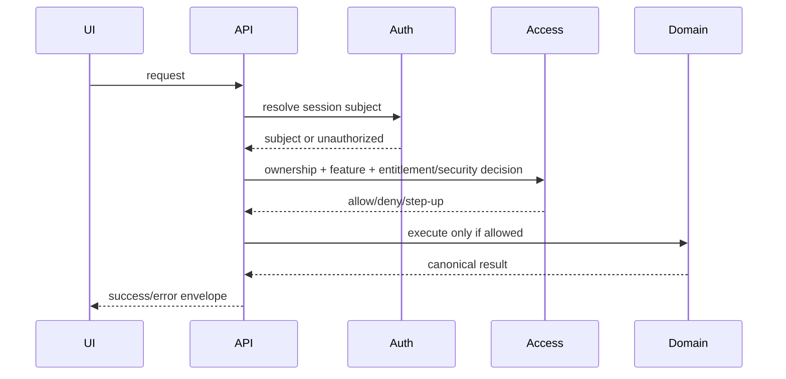

# Auth, Session and Authorization

## Subject model

Application-facing user routes resolve identity server-side from the authenticated session. User-scoped handlers must not trust caller-supplied subject identity.

The established subject model is:

```text
{ subjectKind: 'user', subjectId, userId }
```

The browser may present authenticated UI state, but the server remains authoritative for subject identity and ownership.

## Authentication flow

1. User authenticates through the existing framework/auth routes under `/api/auth/*`.
2. The server resolves the authenticated subject on protected routes.
3. Owner-scoped resources are queried/mutated using the authenticated server-side subject.
4. Missing/invalid authentication produces the canonical unauthorized response.
5. Feature/commercial gates run after identity resolution and before protected payload/side effects where required.

Do not invent a separate bearer-token or refresh-token flow in the frontend unless the frozen implementation explicitly exposes one.

## Authorization layers

ELCEO uses layered authorization rather than a single role check:

- authentication/session;
- owner/subject boundary;
- feature permission;
- commercial entitlement;
- admin/internal permission;
- super-admin/step-up for sensitive controls;
- mutation security/idempotency/rate decision;
- audit/security completion.

## User ownership

User profile, account, portfolio, journal, notification and related user-state APIs are owner-scoped. The client cannot select a different `subjectId` to access another user.

## Internal/admin boundary

Internal/admin routes require the server-side internal boundary and relevant admin feature permission. `x-elceo-internal-token` is a server/internal credential and must never be embedded in browser code, local storage or public runtime configuration.

Admin UI calls must traverse an approved server-mediated environment capable of satisfying the internal boundary; a public browser must not be given the internal token.

## Super-admin step-up

Sensitive commercial-control mutations may require super-admin permission plus a verified step-up challenge. UI flow:

1. request/read step-up readiness;
2. create/receive a challenge where supported;
3. verify challenge;
4. perform the sensitive mutation with the server-recognized verified state;
5. render the mutation result/audit state.

The frontend must not mark step-up as verified locally.

## Commercial entitlements

Entitlement evaluation is server-owned. UI should use account entitlement/access routes to decide what to present, but final route authorization always remains on the server.

Typical outcomes include basic/kick-off access, focus-plan-required access, subscription restrictions on expiry, admin-only access and blocked live-activation paths.

## Session expiry

When a protected request returns unauthorized, treat the session as no longer sufficient for that request and return the user to the authentication flow. Do not preserve privileged UI state solely because an earlier request succeeded.

## Browser storage

Safe browser state is limited to presentation/ephemeral/cache data that does not create authority. Never store internal API tokens, provider keys, payment secrets or server-only authorization truth in browser-accessible storage.


